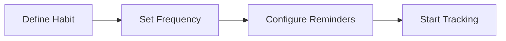
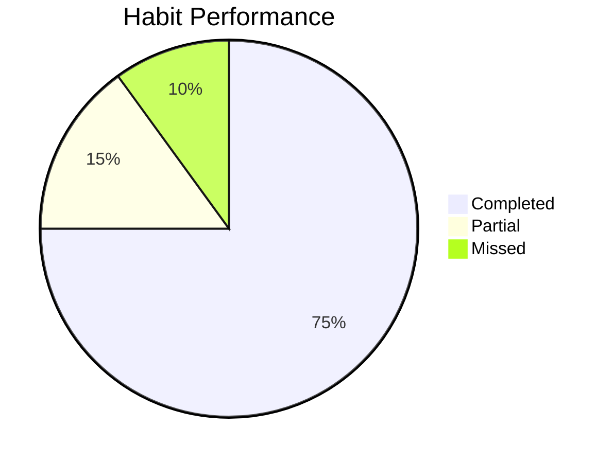

# HabitForge User Guide

## 🚀 Getting Started

### System Requirements
- **Web Browser**: Chrome 90+, Firefox 88+, Safari 14+, Edge 90+
- **Mobile**: iOS 13+ or Android 8+
- **Internet Connection**: Required for sync and AI features

### Quick Start

1. **Sign Up**: Visit [HabitForge](http://localhost:6464) and create your account
2. **Create Your First Habit**: Click "New Habit" and define your goal
3. **Track Daily**: Log your progress using the five-factor system
4. **Watch Your Progress**: See your habit strengthen like a rope

## 📱 Core Features

### 1. Habit Creation

Create habits with comprehensive tracking:

**Habit Types**:
- **Build Habits**: Positive behaviors to develop
- **Break Habits**: Negative behaviors to eliminate

**Categories**:
- Health & Wellness
- Productivity
- Learning
- Fitness
- Mindfulness
- Relationships
- Finance

### 2. Five-Factor Tracking System

Based on "The Power of Habit", track these factors for each habit:

| Factor | Description | Why It Matters |
|--------|-------------|----------------|
| **Location** | Where you perform the habit | Identifies environmental triggers |
| **Emotional State** | How you feel before/after | Reveals emotional patterns |
| **Other People** | Who's around you | Shows social influences |
| **Time** | When it happens | Finds optimal timing |
| **Preceding Action** | What happened before | Discovers trigger chains |

### 3. Rope Visualization

Your habit strength is visualized as a rope that:
- **Grows thicker** with consistent practice
- **Frays** when you miss days
- **Changes material** as it strengthens:
  - Thread (Days 1-7)
  - String (Days 8-21)
  - Cord (Days 22-45)
  - Rope (Days 46-90)
  - Steel Cable (Days 90+)

### 4. Smart Reminders

Intelligent notifications that:
- Learn your optimal reminder times
- Adapt to your schedule
- Use location-based triggers
- Provide contextual motivation

## 🎯 Using HabitForge Effectively

### Daily Workflow

1. **Morning Review** (2 mins)
   - Check today's habits
   - Set intentions
   - Review reminders

2. **Throughout the Day**
   - Receive smart reminders
   - Quick-log completions
   - Track five factors

3. **Evening Reflection** (3 mins)
   - Complete remaining entries
   - Review progress
   - Plan tomorrow

### Best Practices

#### Start Small
- Begin with 1-3 habits maximum
- Focus on consistency over perfection
- Build momentum gradually

#### Be Specific
- Define clear success criteria
- Set measurable goals
- Track quality, not just completion

#### Use the Five Factors
- Log all five factors initially
- Identify patterns after 7 days
- Adjust based on insights

#### Leverage AI Insights
- Review weekly pattern reports
- Follow personalized recommendations
- Adjust timing based on predictions

## 📊 Understanding Your Analytics

### Dashboard Metrics

**Key Metrics**:
- **Completion Rate**: Percentage of successful days
- **Current Streak**: Consecutive days completed
- **Habit Strength**: Overall habit establishment (0-100%)
- **Success Predictors**: Conditions for highest success

### Pattern Recognition

The AI analyzes your data to identify:
- **Triggers**: What initiates your habits
- **Obstacles**: What prevents success
- **Optimal Conditions**: Best time, place, and state
- **Correlations**: How habits affect each other

## 💎 Premium Features

### Free vs Premium

| Feature | Free | Premium |
|---------|------|---------|
| Active Habits | 3 | Unlimited |
| Tracking Entries | 30/month | Unlimited |
| Basic Analytics | ✅ | ✅ |
| AI Insights | Limited | Full |
| Advanced Visualizations | ❌ | ✅ |
| Smart Coaching | ❌ | ✅ |
| Data Export | ❌ | ✅ |
| Priority Support | ❌ | ✅ |

### Upgrading to Premium

1. Navigate to Settings → Subscription
2. Choose Monthly ($9.99) or Yearly ($99.99)
3. Enter payment information
4. Enjoy unlimited features!

## 🏆 Gamification & Achievements

### Milestone Badges

- **First Step**: Complete first day
- **Week Warrior**: 7-day streak
- **Habit Builder**: 21-day streak
- **Monthly Master**: 30-day streak
- **Habit Expert**: 60-day streak
- **Habit Legend**: 90-day streak
- **Centurion**: 100-day streak

### Challenges

Join community challenges to:
- Stay motivated
- Compete with others
- Earn special badges
- Share experiences

## 👥 Community Features

### Accountability Partners

1. **Find a Partner**: Match with similar goals
2. **Share Progress**: See each other's streaks
3. **Send Encouragement**: Motivate each other
4. **Celebrate Together**: Share milestones

### Support Groups

- Join habit-specific groups
- Share success stories
- Get advice from experienced users
- Participate in discussions

## 🔧 Troubleshooting

### Common Issues

**Notifications not working?**
- Check device settings
- Ensure notifications are enabled
- Verify reminder times are set

**Data not syncing?**
- Check internet connection
- Pull to refresh
- Sign out and back in

**Forgot password?**
- Click "Forgot Password" on login
- Check email for reset link
- Create new password

## 🔐 Privacy & Security

### Your Data is Protected

- **End-to-end encryption** for sensitive data
- **GDPR compliant** data handling
- **No data selling** to third parties
- **Export your data** anytime
- **Delete account** permanently if needed

### Data Controls

Access privacy settings to:
- Control data sharing
- Manage visibility
- Export personal data
- Delete specific records

## 📱 Mobile App Features

### Offline Mode
- Track habits without internet
- Sync when connected
- Local notifications work offline

### Native Features
- Biometric authentication
- Camera for progress photos
- Location-based reminders
- Widget for quick access

## 🎯 Tips for Success

### Week 1: Foundation
- Focus on showing up
- Don't worry about perfection
- Track all five factors

### Week 2-3: Building
- Review your patterns
- Adjust reminder times
- Identify best conditions

### Week 4+: Optimization
- Stack related habits
- Use AI recommendations
- Join challenges

## 📞 Getting Help

### Support Channels

- **In-App Help**: Tap the ? icon
- **Email Support**: support@habitforge.com
- **Community Forum**: Share and learn
- **Documentation**: Comprehensive guides

### Feedback

We love hearing from you! Share:
- Feature requests
- Bug reports
- Success stories
- Suggestions

## 🚀 Advanced Features

### Habit Stacking
Link habits together for efficiency:
1. Identify existing routine
2. Add new habit after
3. Create trigger chain

### Batch Tracking
Track multiple habits at once:
1. Group similar habits
2. Set combined reminders
3. Log simultaneously

### Custom Metrics
Track additional data:
- Duration
- Intensity
- Quality rating
- Custom notes

## 🎉 Success Stories

> "HabitForge helped me build a consistent meditation practice. The rope visualization kept me motivated!" - Sarah, 150-day streak

> "Breaking my smoking habit seemed impossible until I tracked the five factors and discovered my triggers." - Mike, 90 days smoke-free

> "The AI insights showed me my best workout times. My consistency improved 300%!" - Emma, Premium user

## 📅 Roadmap

Coming soon:
- Apple Watch & WearOS apps
- Voice command support
- AR rope visualization
- Team challenges
- Coaching marketplace

---

**Remember**: Habits are built one day at a time. Be patient with yourself and trust the process!

For more help, visit our [FAQ](https://habitforge.com/faq) or contact support.